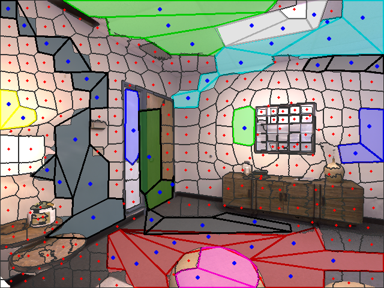
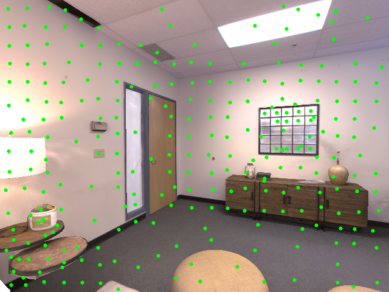
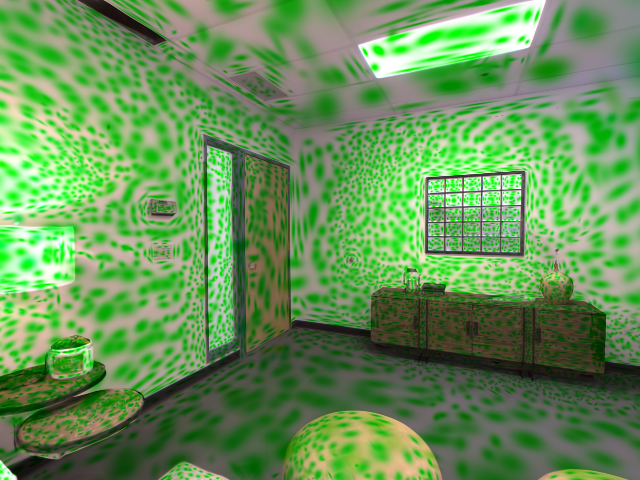
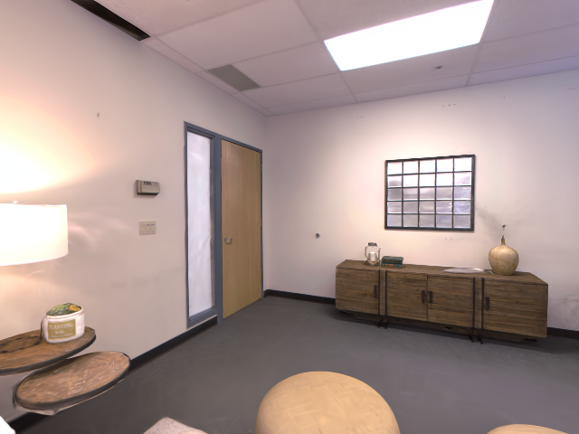

# Superpixel-guided Sampling for Compact 3D Gaussian Splatting

Myoung Gon Kim, SeungWon Jeong, Seohyeon Park, JungHyun Han

[[`Paper`](https://dl.acm.org/doi/10.1145/3641825.3687719)]

<div align="center">
<table>
  <tr>
    <td align="center"></td>
    <td align="center"></td>
    <td align="center"></td>
    <td align="center"></td>
  </tr>
  <tr>
    <td align="center">Superpixel-guided sampling</td>
    <td align="center">Sampled points</td>
    <td align="center">Optimized 3D Gaussians</td>
    <td align="center">Rendering result</td>
  </tr>
</table>
</div>

## BibTex
```
@inproceedings{kim2024superpixel,
  title={Superpixel-guided Sampling for Compact 3D Gaussian Splatting},
  author={Kim, Myoung Gon and Jeong, SeungWon and Park, Seohyeon and Han, JungHyun},
  booktitle={Proceedings of the 30th ACM Symposium on Virtual Reality Software and Technology},
  pages={1--15},
  year={2024}
}
```

---

## 0. Pre-requisite
 - pytorch
 - cv2
 - numpy
 - tqdm
 - \+ all pre-requisite of 3DGS

## 1. Dataset Pre-processing 
This project implementation is primarily designed with the **Replica** dataset.<br>
Users must pre-process the dataset to ensure it matches the input format required for this project.

### 1.1 Dataset
 - RGB dataset (.png by default)
 - Depthmap dataset (.tiff by default)

### 1.2 Directories and files from COLMAP
 - sparse/0
   - COLMAP creates this directory which contains 'cameras.bin', 'images.bin' and 'points3D.bin' (or as .txt)
   - Locate it (copy) at the dataset path.
 - images.txt
   - This file is from COLMAP. Locate it (copy) at the dataset path.

### 1.3 File lists
 - rgb_list.txt
   - This is list of rgb image paths. in this .txt file, all images needs to be sorted and listed.
   ``` 
     path/rgb_0.png
     path/rgb_1.png
     path/rgb_2.png
     ...
     path/rgb_899.png 
   ```
    
 - depth_list.txt
   - This is list of depth image paths. in this .txt file, all images needs to be sorted and listed.
   ``` 
     path/depth_0000.tiff
     path/depth_0001.tiff
     path/depth_0002.tiff
     ...
     path/depth_0899.tiff
   ```
 - Locate them at your dataset path
  

## 2. Run
```python run.py --scene_path C:/your_path```

## 3. Result
Check results at ``your_dataset_path/save/``

## 4. Optimize (train)
- Rename `save/input.ply` as `sparse/0/points3D.ply`
- Train it using Original [3D Gaussian-Splatting](https://repo-sam.inria.fr/fungraph/3d-gaussian-splatting/).
  - skip the `convert.py` part
  - In `arguments/__init__.py`(of Original 3DGS), modify two parameters
    - self.densify_from_iter = 500
    - self.densify_until_iter = 1600
  - `python train.py -s c:/your_path`
  


## Funding and Acknowledgments 
This research was supported by the Ministry of Science and ICT,Korea, under the ICT Creative Consilience Program (IITP-2024-2020-0-01819), ITRC (Information Technology Research Center)Support Program (IITP-2024-2020-0-01460) and the grant no. 2020-0-00861.

Our research builds upon the foundation established by [Gaussian-Splatting](https://repo-sam.inria.fr/fungraph/3d-gaussian-splatting/) / [(github)](https://github.com/graphdeco-inria/gaussian-splatting) and [Hertel Mehlhorn Convex Decomposition](https://link.springer.com/chapter/10.1007/3-540-12689-9_105) / [(github)](https://github.com/ivanfratric/polypartition)


